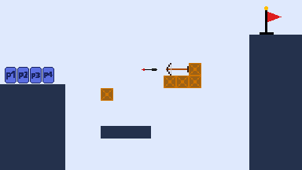

 

## 게임 이름
best chicken race

## 개요
얼티밋 치킨 홀스 모작

## 플레이 방법
전반적인 플레이는 얼티밋 치킨 홀스와 유사 
1턴마다 맵에 지정된 모양 & 특징을 가진 오브젝트를 설치 하고 오브젝트가 설치된 맵에서 게임을 플레이 
골인지점에 모두가 들어간다면 아무점수를 받지않고 한명이라도 못 들어간다면 점수를 주고 다음턴을 시작

## 조작법
- WASD
  - 이동
- SPACE
  - 점프
- 좌클릭
  - 오브젝트 설치