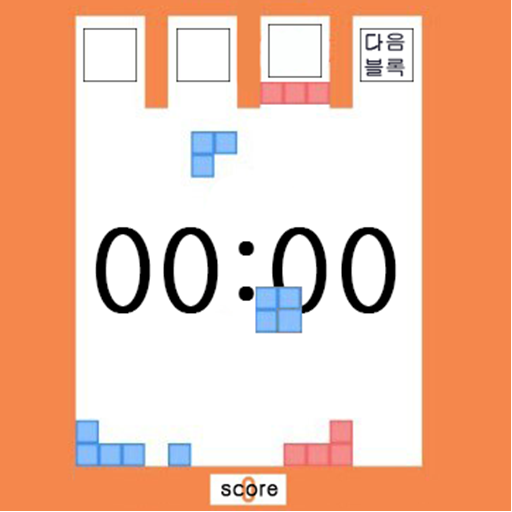

 

## 게임 이름
multris

## 개요
다수의 플레이어가 협동하여 진행하는 테트리스 
피코파크 Lv8 테트리스 모작

## 플레이 방법
주어진 블록을 쌓고, 가로 한 줄이 채워진 줄은 사라진다. 
맨 위까지 블록이 쌓이지 안게끔 하여 최대한 오래 버티는 것이 목표. 
다른 플레이어가 놓은 블록에만 블록을 놓을 수 있다.

## 조작법
- 좌우 화살표
  - 블록 회전
- 아래 화살표
  - 블록 속도 가속

