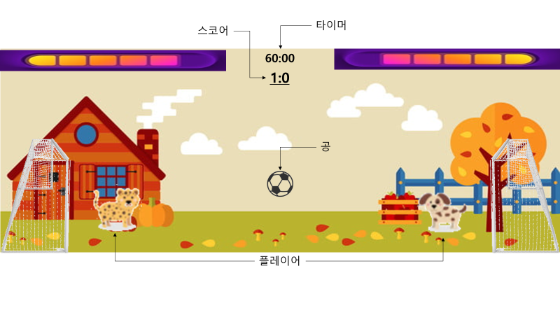

 

## 게임 이름
Animal Soccer

## 개요
공 크기의 동물들이 축구하는 게임 
헤드사커 모작 멀티버전

## 플레이 방법
전반적인 플레이는 헤드사커와 동일 
1분간 골을 더 많이 넣는 사람이 이기는 게임 
1분간 승부가 가려지지 않으면 골이 나올 때 까지 추가시간 진행

## 조작법
- SPACE
  - 점프
- A, D
  - 좌우 이동
- L-SHIFT
  - 대쉬
- 좌클릭
  - 발차기
- 우클릭
  - 스킬