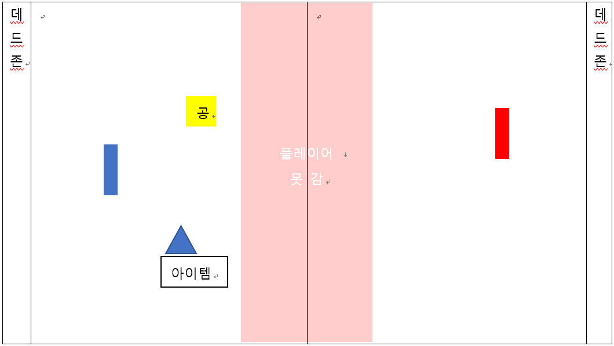

 

## 게임 이름
퐁

## 개요
2명의 플레이어가 공을 주고받는 게임 
퐁 모작 멀티버전

## 플레이 방법
1. 두 명의 플레이어가 상, 하, 좌, 우로 움직여 공을 서로에게 튕겨냄.
2. 아이템이 서로의 구역에 랜덤 생성 됨. (상대에게는 보이지 않음)
3. 직접 움직여 닿으면 아이템은 즉시 발동됨.
4. 튕겨내지 못하고 플레이어 뒤, 벽(데드 존) 에 공이 닿으면 사라짐 ( 남은 공이 없을 시 패배)

## 조작법
- 마우스
  - 마우스 위치를 따라 일정 속도로 이동

## 아이템
1. 공 복제
   - 공이 복제된다.
2. 페이크 공
   - 공에 닿으면 패배. 데드존에 닿아도 사라지지 않고 튕겨내어진다.